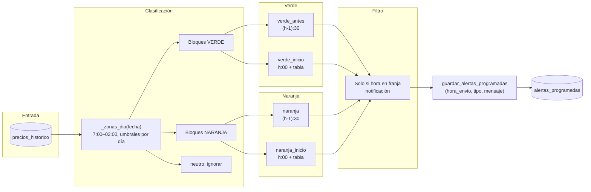

# Flujo: generación de alertas

Las alertas se generan a partir de los precios del día ya guardados. Se clasifican las horas en "verde" (barato), "naranja" (caro) y "neutro", y se crean mensajes de texto fijo (cabecera + tabla cuando aplica).

## Detalle del flujo

### 1. Precios y contexto

- Se leen los tramos del día con `repo.obtener_precios_fecha(fecha)`.
- `_precios_texto(fecha)` genera un texto con todas las horas y precios (usado internamente si se necesitara).

### 2. Zonas del día (_zonas_dia)

- Franja considerada: **7:00 a 02:00** (horas 7..23 y 0..2 en ese orden).
- Umbrales según día: entre semana (`PRECIO_UMBRAL_BAJO` / `ALTO`), fin de semana (`PRECIO_UMBRAL_BAJO_FINDE` / `ALTO_FINDE`). Ver [Configuración](../configuracion.md#umbrales-de-precio).
- Por hora:
  - **Verde**: precio ≤ umbral bajo
  - **Naranja**: precio ≥ umbral alto
  - **Neutro**: resto (no generan alerta)

### 3. Bloques y tipos de alerta

- **Bloque verde**:
  - **verde_antes**: envío a las (hora_inicio - 1):30 (aviso 30 min antes). Solo si esa hora está en franja de notificación.
  - **verde_inicio**: envío a hora_inicio:00; cabecera + tabla de precios de la franja. Solo si está en franja.
- **Bloque naranja**:
  - **naranja**: envío 30 min antes, (hora_inicio - 1):30.
  - **naranja_inicio**: envío a hora_inicio:00; cabecera + tabla. Solo si está en franja.

### 4. Mensajes

- Sin LLM: cabecera con emoji y franja (🟢 FRANJA BARATA · HH:00–HH:00 o 🟠 FRANJA CARA · …). En "inicio", se añade tabla de precios con emojis 🟢🟡🔴 según umbrales.

### 5. Guardado

- Lista de tuplas `(hora_envio, tipo, mensaje)` filtrada por franja de notificación.
- `guardar_alertas_programadas(fecha, alertas)` borra las alertas del día e inserta las nuevas.

## Quién dispara la generación

- **Automático**: job `job_diseno_alertas` a las 21:00 (tras el fetch de las 20:30).
- **Manual**: comando `/generate_tips` (opcionalmente hace fetch de hoy si faltan datos; luego `generar_alertas_dia` y el usuario recibe cada alerta en vivo).

## Archivos

- `src/scheduler/alertas_ia.py`: `generar_alertas_dia`, `_zonas_dia`, `_precios_texto`, `_tabla_franja`, `job_diseno_alertas`
- `src/storage/repository.py`: `obtener_precios_fecha`, `guardar_alertas_programadas`
- `config/settings.py`: umbrales, `get_umbrales_fecha`, `hora_en_franja_notificacion`
