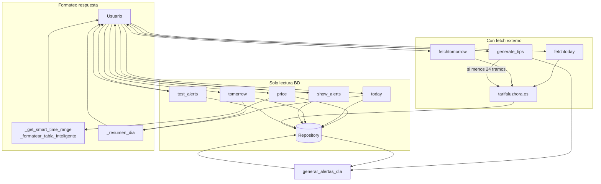

# Flujo: comandos de consulta de precios

Cuando el usuario lanza un comando que pide información de precios o datos relacionados, el flujo depende del comando.

## Por comando

### /price

1. Permisos de chat.
2. `repo.obtener_precios_fecha(hoy)`.
3. Si no hay datos → mensaje para usar /fetchtoday o esperar al job.
4. Construye `PreciosDia` y calcula el rango "inteligente": 3 h antes + hora actual + 3 h después; al final del día incluye 00:00–02:00 de mañana, al inicio incluye 21:00–23:00 de ayer si hay datos.
5. `_formatear_tabla_inteligente` (emojis 🟢🟡🔴 según umbrales del día; etiquetas "(ayer)"/"(mañana)" cuando aplica).
6. Responde con la tabla.

### /today

1. Permisos.
2. `repo.obtener_precios_fecha(hoy)` → si vacío, mensaje de "no data".
3. `_resumen_dia(precios, "(hoy)")`: min, max, media, desglose por hora con emojis según umbrales.
4. Envía el resumen.

### /tomorrow

- Igual que `/today` pero con `hoy + timedelta(days=1)` y "(mañana)".

### /fetchtoday

1. Permisos.
2. Mensaje "⏳ Obteniendo precios de hoy...".
3. `fetch_precios_dia(hoy)` → HTTP a tarifaluzhora (URL base), parseo, validación 24 tramos y fecha en `<h2 class="template-tlh__title">`.
4. Si falla o fecha web ≠ hoy → mensaje de error (o "no hay datos para hoy").
5. `repo.guardar_precios_dia(precios.fecha, tramos)`.
6. Responde con min, max y número de horas.

### /fetchtomorrow

- Mismo flujo para la fecha de mañana; URL con `?date=YYYY-MM-DD`.

### /generate_tips

1. Permisos.
2. `repo.obtener_precios_fecha(hoy)`.
3. Si hay menos de 24 tramos: fetch de hoy, guardar, mensaje de precios obtenidos.
4. Mensaje "📋 Generando alertas del día… Las irás recibiendo en vivo."
5. `generar_alertas_dia(hoy, on_alert=...)`: genera alertas y envía cada una al chat del usuario al momento.
6. `repo.guardar_alertas_programadas(hoy, alertas)`.
7. Mensaje "✅ N alertas generadas y guardadas para hoy."

### /show_alerts

1. Permisos.
2. `repo.obtener_alertas_dia(hoy)`.
3. Si vacío → "📭 No hay alertas para hoy. Usa /generate_tips para crearlas."
4. Lista cada alerta: estado (✅/⏳), hora_envio, tipo, mensaje.

### /test_alerts

1. Permisos.
2. `repo.obtener_alertas_dia(hoy)`.
3. Si vacío → "📭 No hay alertas para hoy. Usa /generate_tips primero."
4. Envía el mensaje de la primera alerta como "🧪 ALERTA DE PRUEBA" y pie con hora y tipo.

## Resumen de uso de BD y red

| Comando         | Lee BD      | Escribe BD   | Red (tarifaluzhora) | LLM   |
|-----------------|------------|-------------|----------------------|-------|
| /price          | sí (hoy, mañana, ayer) | no   | no                   | no    |
| /today          | sí (hoy)   | no          | no                   | no    |
| /tomorrow       | sí (mañana)| no          | no                   | no    |
| /fetchtoday     | no         | sí          | sí                   | no    |
| /fetchtomorrow  | no         | sí          | sí                   | no    |
| /generate_tips  | sí (hoy)   | sí (precios + alertas) | opcional (fetch hoy) | no    |
| /show_alerts    | sí (alertas hoy) | no   | no                   | no    |
| /test_alerts    | sí (alertas hoy) | no   | no                   | no    |
