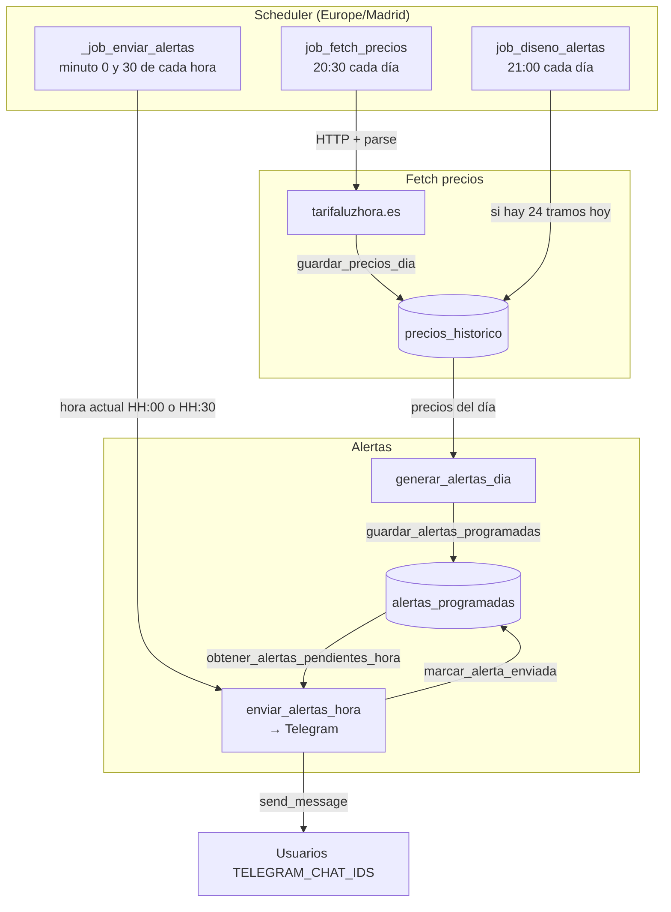

# Flujo: procesos periódicos del bot

El bot ejecuta tres jobs con **APScheduler** en timezone `Europe/Madrid`. No dependen de que un usuario envíe un mensaje.

## Descripción de cada job

### 1. job_fetch_precios (20:30)

- **Qué hace**: Descarga precios de **hoy** y **mañana** desde la web configurada (`TARIFALUZHORA_URL`), parsea los 24 tramos y los guarda en `precios_historico`. Para mañana usa la URL con `?date=YYYY-MM-DD`.
- **Código**: `src/scheduler/jobs.py` → `src/precios/tarifaluzhora.py` (`fetch_precios_dia`) y `repository.guardar_precios_dia`.

### 2. job_diseno_alertas (21:00)

- **Qué hace**: Comprueba que existan al menos 24 tramos para hoy. Si es así, llama a `generar_alertas_dia(hoy)` (clasificación verde/naranja/neutro y generación de mensajes; solo se incluyen alertas en la franja de notificación) y guarda el resultado en `alertas_programadas`, borrando antes las alertas de ese día.
- **Código**: `src/scheduler/jobs.py` → `src/scheduler/alertas_ia.py` (`job_diseno_alertas`, `generar_alertas_dia`).

### 3. _job_enviar_alertas (cada :00 y :30)

- **Qué hace**: Obtiene la hora actual en `Europe/Madrid` (formato `HH:MM`). Llama a `job_enviar_alertas_hora_async(bot, hora)`, que solo actúa si la hora está dentro de la franja de notificación (`ALERTAS_HORA_INICIO`–`ALERTAS_HORA_FIN`). Entonces:
  - Busca en BD las alertas de hoy con esa `hora_envio` y no enviadas.
  - Envía cada mensaje a todos los `TELEGRAM_CHAT_IDS`.
  - Marca cada alerta como enviada.
- **Código**: `src/main.py` (_job_enviar_alertas), `src/scheduler/jobs.py` (job_enviar_alertas_hora_async), `src/telegram_bot/alerts.py` (enviar_alertas_hora).

## Orden típico en un día

1. **20:30** → Se actualizan precios de hoy y mañana.
2. **21:00** → Se generan y guardan las alertas del día (solo las que caen en la franja 7:00–24:00 por defecto).
3. **21:00, 21:30, 22:00, ...** → A las horas programadas en cada alerta, el job de envío las envía (si está en franja) y las marca como enviadas.
